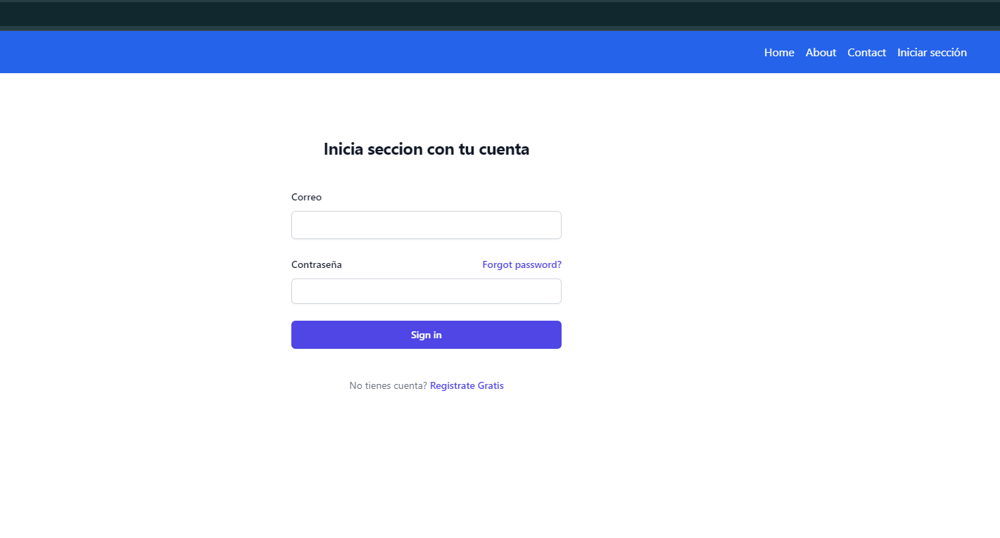
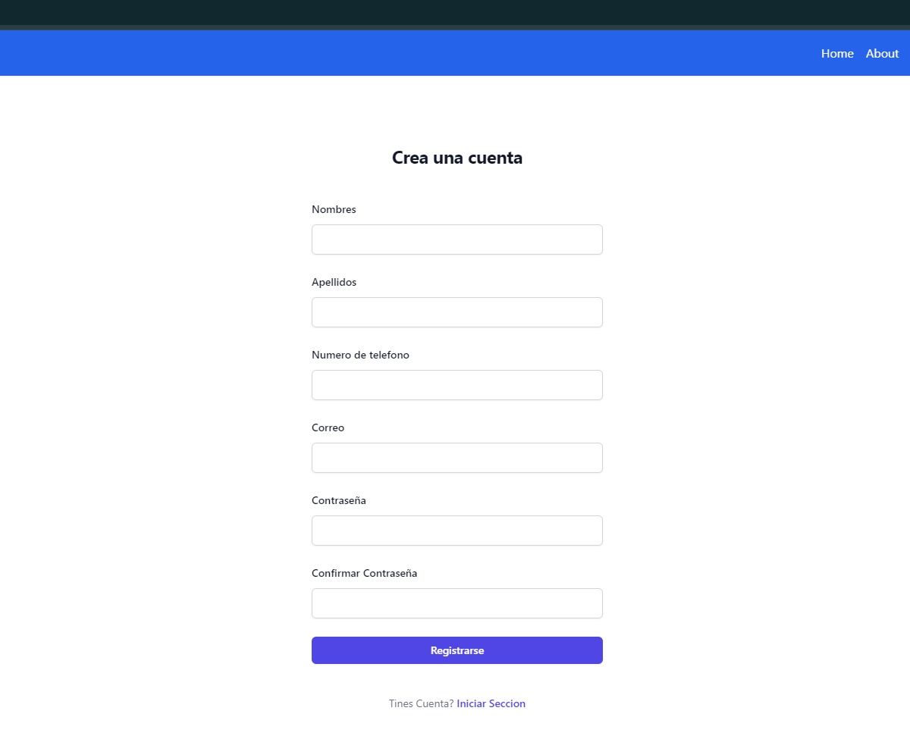
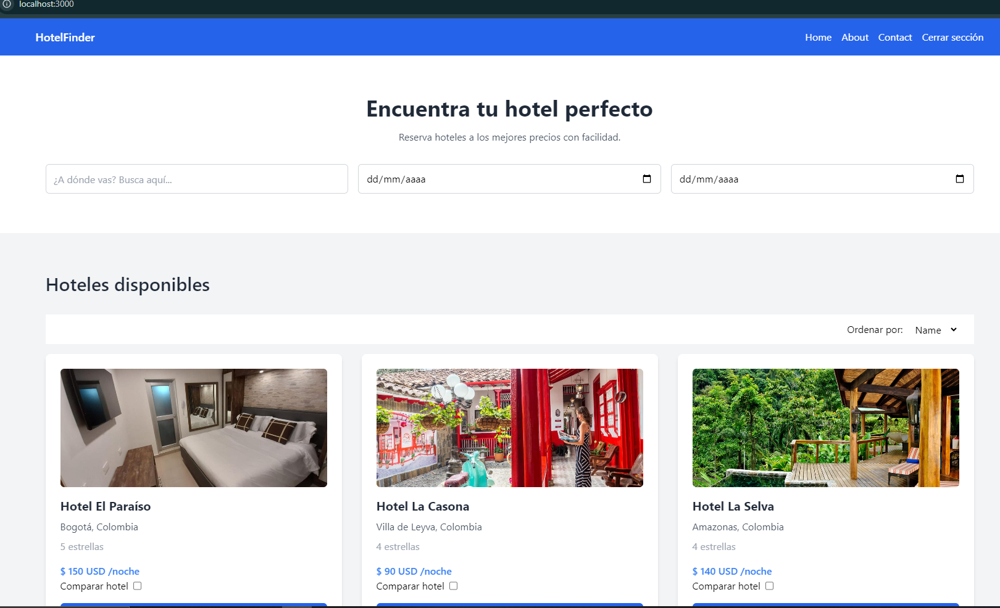
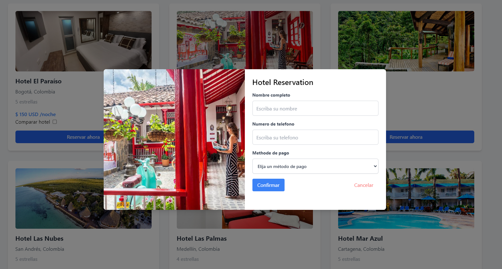

# Hotel Reservación - Prueba Técnica

Este proyecto es una aplicación web de reservas de hoteles desarrollada con Nuxt 3. La aplicación permite a los usuarios buscar, comparar y reservar hoteles de manera rápida y sencilla.

### Funcionalidades Principales:
- Login y Registro: Los usuarios pueden crear una cuenta y acceder a la aplicación mediante un sistema de autenticación seguro.

- Página Principal: Una vez autenticados, los usuarios pueden navegar por una lista de hoteles disponibles, cada uno con su respectiva descripción, ubicación, clasificación por estrellas y precio por noche. También pueden utilizar filtros de búsqueda para encontrar el hotel que mejor se adapte a sus necesidades.

## Características

- **Nuxt 3**: Construido con la última versión de Nuxt.js para aprovechar su velocidad y funcionalidad.
- **SSR (Server-Side Rendering)**: Renderizado en el servidor para una mejor SEO y tiempos de carga más rápidos.
- **Componentes**: Componentes reutilizables y modulares.
- **Vue 3**: Aprovecha el poder de Vue 3.
- **Tailwind CSS**: Estilos rápidos y modernos con Tailwind CSS (si lo estás usando).


## Enlace en Producción

Puedes probar la aplicación en producción aquí: [Hotel Finder en Producción](https://hotel-reservacion-frontend-production.up.railway.app/)

## Repositorios

Este proyecto consta de dos repositorios:

- Frontend: [https://github.com/jaimecalderon19/hotel-reservacion-frontend.git](https://github.com/jaimecalderon19/hotel-reservacion-frontend.git)
- Backend: [https://github.com/jaimecalderon19/hotel-reservacion-backend.git](https://github.com/jaimecalderon19/hotel-reservacion-backend.git)

## Capturas de Pantalla

Aquí tienes algunas capturas de pantalla del proyecto:






## Requisitos Previos

Asegúrate de tener instalado lo siguiente antes de comenzar:

- [Node.js](https://nodejs.org/) (v14 o superior)
- [npm](https://www.npmjs.com/) o [yarn](https://yarnpkg.com/) (gestor de paquetes)

## Instalación

Clona ambos repositorios y navega al directorio del proyecto frontend:

```bash
git clone https://github.com/jaimecalderon19/hotel-reservacion-frontend.git
git clone https://github.com/jaimecalderon19/hotel-reservacion-backend.git
cd hotel-reservacion-frontend
```

Instala las dependencias del proyecto:

```bash
npm install
# o
yarn install
```

## Ejecución

Para iniciar el servidor de desarrollo:

```bash
npm run dev
# o
yarn dev
```

La aplicación estará disponible en `http://localhost:3000`.

## Construcción para producción

Para construir la aplicación para producción:

```bash
npm run build
# o
yarn build
```


## Estructura del Proyecto

Describe brevemente la estructura de directorios de tu proyecto, por ejemplo:

```
├── components/     # Componentes Vue reutilizables
├── layouts/        # Layouts de la aplicación
├── pages/          # Páginas de la aplicación
├── plugins/        # Plugins de Nuxt
├── public/         # Archivos estáticos públicos
│   └── videos/     # Videos del proyecto
│       └── pruebatecnica.mp4  # Video de demostración
├── server/         # Lógica del servidor (si se utiliza)
├── stores/         # Stores de Pinia (si se utilizan)
├── utils/          # Funciones de utilidad
└── ...
```

## Tecnologías Utilizadas

- [Nuxt 3](https://nuxt.com/)
- [Vue 3](https://vuejs.org/)
- [Tailwind CSS](https://tailwindcss.com/) (si lo estás usando)
- [Pinia](https://pinia.vuejs.org/) (si lo estás usando para manejo de estado)